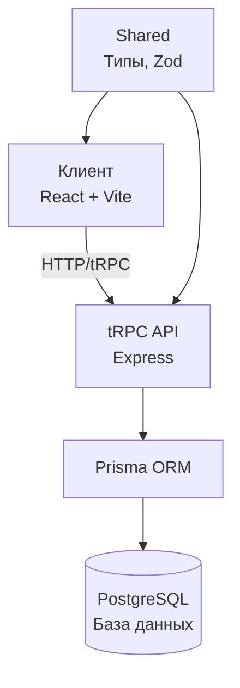

# 🏗️ Архитектура

Этот раздел описывает архитектуру проекта Barbershop.

## 📦 Общая структура



### 🧩 Компоненты

- **`client`** — фронтенд на React 19, TypeScript, Vite. Использует Mantine для UI.
- **`server`** — бэкенд на Express, tRPC, Prisma. Обрабатывает запросы и взаимодействует с БД.
- **`shared`** — пакет с общими типами и схемами валидации (Zod). Используется обоими частями.

## 🔄 Поток данных

1. Пользователь взаимодействует с интерфейсом (например, выбирает услугу и время).
2. Фронтенд делает запрос через `@trpc/react-query` к tRPC-роуту.
3. Сервер получает запрос, валидирует через `zod`, проверяет авторизацию (JWT).
4. Данные обрабатываются через Prisma и сохраняются в PostgreSQL.
5. Ответ возвращается клиенту, интерфейс обновляется через React Query.

## 🔐 Авторизация

- Аутентификация: JWT
- Хранение паролей: `bcryptjs`
- Защита роутов: middleware в tRPC-контексте

## 🧱 Монорепозиторий

- Управление: `pnpm` + `pnpm-workspace.yaml`
- Алиасы в Vite:
  ```ts
  alias: {
    shared: ../shared/src,
    server: ../server/src,
    src: ./src
  }
  ```

> ⚠️ Внимание: `shared` не должен импортировать код из `server` или `client`, чтобы избежать циклических зависимостей.